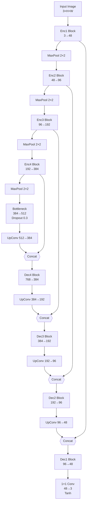

# Image Deblurring Project

## Project Overview
This project focuses on deblurring blurred images using deep learning.  
The model is trained to take blurred images as input and produce sharp images as output.

## Dataset
- The dataset used is from Kaggle.  
- [Dataset Link](https://www.kaggle.com/datasets/emrehakanerdemir/face-deblurring-dataset-using-celeba)
- Note: The dataset mentioned in the earlier project proposal is not used. Only the link provided above is correct.

## Model Architecture




- The model follows an Encoder → Bottleneck → Decoder structure. It is based on U-Net architecture.
- It is trained using pairs of blurred and sharp images.
- Loss Function:
  - Initially uses MSE loss.
  - Later, switches to a hybrid loss combining MSE and Gradient Loss.
  - The balance between MSE and Gradient Loss is controlled by a parameter (alpha) defined in the `config` file.

## Project Structure
- Training:
  - The dataset is split into training and validation sets.
  - Cross-validation was not used; the split remains constant. This is because of availability of large number of data.
  - Training progress is shown using tqdm loading bars.
  - The prediction is done on the validation dataset created.
- Prediction (predict.py):
  - Displays blurred input, model output, and ground truth images sequentially.
  - To display more images, modify the `num_images` variable in `predict.py`.
  - After closing one displayed image, the next one will appear automatically.
 
    
 ## Trained Models

The `checkpoints` folder contains trained model weights:

1. `final_weights.pth` - The final trained model weights
2. (After training) Two additional files will be generated:
   - `checkpoint.pth` - Contains epoch number and optimizer state (for resuming training)
   - `checkpoint_without_optimizer.pth` - Contains only model weights (for inference/prediction)

## Prediction Instructions

The current `predict.py` script handles model inference with the following workflow:

1. It contains `show_predictions(blur folder path, num_images = 1)` which takes path of the folder where blur images are stored in.
2. It then predicts the outcome based on the trained model in checkpoint folder.
3. The number of images it predicts from the `blur folder path` depends on `num_images` mentioned. By default it is 1.


### NOTE : THE `predict.py` HAS BEEN EDITED LATER. IF YOU RUN THE OLDER VERSION, EITHER RECLONE OR FOLLOW THE BELOW INSTRUCTIONS WRITTEN FOR OLDER VERSION OF `predict.py`.
1. Place your test images in the `data/blur` folder
2. The script uses a dataloader that automatically picks images from:
   - `data/blur` - For input blurred images
   - `data/sharp` - For corresponding ground truth (if available for comparison)
3. The `predict` function takes two arguments:
   - `dataloader` - Handles loading of images
   - `model` - The trained deblurring model
 4. Also make sure to set high `val_ratio` in `get_dataloaders` in `dataset.py` while running inference so that all images can be tested. Alternatively enable shuffle in val_loader in get_dataloaders in `dataset.py`

## Training Details

The `train.py` script implements the training loop with these characteristics:

- Uses `tqdm` package for progress bars during training. Due to this the loop differs slightly from that mentioned in google classrom.


## Important Note
- A better model was built, but it exceeds GitHub’s 100MB file size limit, and therefore could not be uploaded. I will soon upload a drive link to that model. Till then there's a smaller model available for immediate usage in `checkpoint` with name `final_weights.pth`

## Requirements
- Python 
- PyTorch
- tqdm
- (Other dependencies can be installed as needed.)

## Usage Example
```bash
# Clone the repository
git clone https://github.com/Swapnil-projects/project_Swapnil_Manna.git

# Install dependencies
pip install -r requirements.txt

# Train the model
python train.py

# Predict and visualize results
python predict.py
